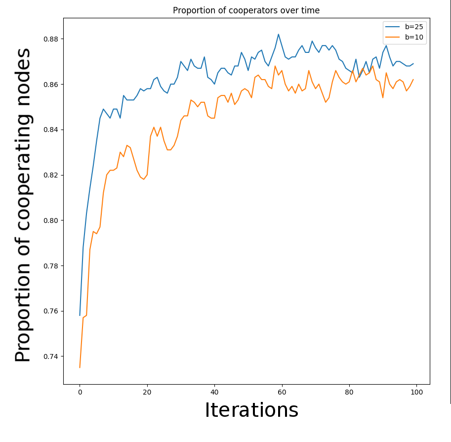

# Effects of Defectors on Greedy Routing in Complex Networks
### Nick Steelman, Matt Brucker

#### Abstract
In the realm of Internet of Things (IoT) devices, the successful delivery of messages is critical to the functioning of the system. If all devices cooperate in the sending of messages, the system as a whole achieves success; but if a certain percentage of devices refuse to pass on messages, complete breakdown of the network can occur. In this paper, we reconstruct and build upon the work of Kleineberg, Kaj-Kolja and Helbing. We replicate their game, in which individual nodes pay a cost to help send messages, but are rewarded for helping successfully deliver a message; then, we construct synthetic networks according to a power-law feature distribution, mapping to the real-world topology of networks such as the IoT. We next perform greedy participatory greedy routing using one of two algorithms. The first, used by Kleineberg et al., has nodes choose to copy the behavior of one of their neighbors randomly when deciding whether to pass on messages or drop them. Our method has nodes simply choose randomly whether to defect based on their payoff from the game. From this simulation, we find that ____.

#### IoT and Greedy Routing

Most Internet-related networks - specifically, in the focus of this paper, the Internet of Things (IoT) - rely upon the cooperation of individual machines in order to successfully transmit messages to their destination. However, sending a message has a cost: sending packets requires power and data, and in the actual transmission of data in IoT devices, there is no explicitly-defined payoff for most of the nodes involved with the successful sending of a message. Therefore, it may not be worthwhile for devices to participate in this process. Kleineberg et al. propose an IoT "game" in which each node, representing an individual IoT device, decides whether it will participate, and continue to participate, in the message-sending process, based primarily on two factors: the cost associated with helping send a message, and the payoff for the successful sending of a message. This payoff is a distributed reward that is given to all nodes that help successfully deliver a message: in a real-world context, this could take the form of a small amount of cryptocurrency given to each machine in the network. Based on how much payoff it's getting relative to the amount it's paying, each node can decide to "defect" - i.e., it can remain a part of the network, but refuse to forward messages. With this behavior for nodes, macro-scale patterns begin to emerge, leading to potential success or total breakdown over larger periods of time.

#### Simulating Greedy Routing

##### Building Complex Networks

We construct synthetic complex networks by starting with a number of nodes *N* and a feature, *k*, which has a power law distribution:

Where *alpha* is a parameter based on the mean degree of the network, and *gamma* is the degree of the network in the range (2,3). Each node also also has a *theta* drawn from a uniform random distribution on [0, 2pi). Each pairs of nodes is then connected with a probability that is correlated to how close the thetas of the nodes are and how high the *k* values of the nodes are. Finally, each node is assigned a radius *r* based on its value of *k*, with higher *k* values giving lower *r* values.

**Figure 1.** A synthetic complex network constructed with *N* = 2500.

As can be seen in *Figure 1*, The values *r* and *theta* map each node into a 2-dimensional polar space. Two nodes' distance in this space represent their similarity, not their physical distance; two nodes that are very close to each other are very similar. Also note that low values of *r* are very rare, as they correspond to high values of *k*, which has a very low probability in a power law distribution.

##### Greedy Routing

*Greedy routing* is the process of sending messages from a source to a destination node by hopping from node to node. The key component of greedy routing is that each node determines whether to participate based on how much payoff it's getting; if a node keeps spending resources without any payoff, it becomes more likely to defect. We run greedy routing in three phases:
1. *Initialization:* After creating a synthetic complex network of *N* nodes using the process above, we distribute the initial cooperator and defector nodes randomly with proportion *C0*.

**Figure 2.** A synthetic complex network constructed with *N* = 2500 and *C0* = 0.6. Orange nodes represent defectors.

2. *Navigation:* We randomly choose two nodes as the source and destination nodes for a message. Nodes then attempt to bring the message closer to the destination by forwarding it to their neighbor closest to the destination. This occurs until the message is successfully delivered, or until sending fails from either reaching a defector node or reaching a loop. At this point, payoffs are calculated: all nodes that participated in the sending start with an initial payoff of -1, since they used resources to help send the message. If the sending is successful, they all receive a share of the payoff, *b/l*, where *b* is the total payoff and *l* is the length of the chain of nodes that sent the message.
3. *Redistribution:* After *N* messages are sent, whether successfully or unsuccessfully, each node has a chance to change their defector status. Kleineberg et al. determine the probably of changing status by having each node pick a neighbor and copy its state with a probability based on the difference between payoffs; the lower a payoff, the more likely a node is to change status.

However, in our model, we simulate this process differently, as we discuss later in the paper. After each node has a chance to change its state, the process of navigation begins again.

#### Simulation

In order to get results in a reasonable amount of time, we scaled back Kleineberg et al.'s experiment to only running 10 iterations of message sending before recording the state of the system. We run several iterations in order for the system to eventually reach a steady state, at which time we record the proportion of nodes that are cooperating. This gives us a measure of  

**Figure 3.** The proportion of cooperators in the network as a function of the payoff, *b*, and the initial proportion of cooperating nodes, *C0*. Simulated with 10 steps on a network with *N* = 1000, *gamma* = 2.5, and mean degree of 6.

#### Impact of System Parameters

As can be seen in *Figure 3,* the percentage of nodes that cooperate after the system reaches a stable state is highly dependent on the initial proportion of cooperators, as well as the payoff. With a high payoff for successfully sent messages, the success will propagate, and even with a low initial proportion of cooperators, the system will eventually reach a state of mostly cooperation; the same goes for having a high initial proportion of cooperators.

**Figure 4.** The proportion of cooperators over time, with *N* = 1000, and *b* = 10 and 25.

*Figure 4* illustrates this property; with a higher payoff value, the time to converge on a state of high cooperation is faster. There is also a distinct grouping between the high and low proportions of cooperators, which indicates that the system tends to converge to either a cooperative or non-cooperative state. 

#### An Alternative System of Defecting

In the algorithm used by Kleineberg et al., each nodes decides whether to defect by observing the state of its connected nodes and randomly copying the behavior of one neighbor. We found this behavior to be an overly complex methodology that doesn't map very well to how actual IoT devices behave, since actual IoT devices don't directly observe the functions of other devices. Instead, most IoT devices act on their own and behave based on their own state. We propose a simplified version of the "defector decision" in which each node decides whether to defect based solely on the internal optimization of its payoff. This maps more closely to the real-world behavior of IoT devices: a device may have a built-in setting to disable itself if it's consuming too much power, or the user of the device may also choose to disable it if it uses excessive power.

#### Internal Greedy Decision-Making

We perform the optimization and decision-making of each node randomly, based on the total payoff of each node. Additionally, each defected node also has a random chance, *C,* of re-cooperating in order to account for things like users turning devices back on. This method of determing which nodes defect is much simpler than that used by Kleineberg et al, and we believe it more accurately reflects the actual behavior of devices. We use this new model to explore how the same parameters have an effect on this system in comparison to how they affect the system used by Kleineberg et al.

#### Results of Internal Greedy decision-Making

#### Conclusion

#### Annotated Bibliography

Kleineberg, Kaj-Kolja, and Dirk Helbing. “Collective navigation of complex networks: Participatory greedy routing.” Nature News,
Nature Publishing Group, 6 June 2017, www.nature.com/articles/s41598-017-02910-x. Accessed 21 Sept. 2017.

*This paper dives into abstracting a simulating systems such as the emerging network of IoT devices which desire
to send data to a desired location. Since it is not efficient for every node to know the state of the entire system,
a method of communication can be a form of "greedy algorithm" in which each nodes sends the data to the nearest neighbor
closest to the destination. However, they added in a probability that a node would become a "defector" which renders the
message unsendable and in large numbers invalidates the network. This probability is based on the number of defector neighbors
and how much a reward the node gets for properly delivering a message. They found that each graph they instantiate either
collapses into nearly all defector or participant given enough time. The probability of collapsing into each is heavily
influenced by both the size of the kickback the nodes receive and the state of some "hubs" in the graph that connect to
a large number of nodes. Additionally, they found the state of defectors tend to first organize themselves into clusters
of all participant or all defector.*

Krapivsky, P. L., and S. Redner. “Emergent Network Modularity.” [1706.01514] Emergent Network Modularity,
20 June 2017, arxiv.org/abs/1706.01514. Accessed 18 Sept. 2017.

*This paper explored a model of graph growth and it's emergent properties. The method of growth was
for every new node added, it was randomly assigned to a node in the graph, and then randomly connected
to a neighbor of that node. The paper cited several applications of this application in the past with
directed graphs and proposed to further explore the concept in the context of undirected graphs, which
better approximate topics such as social media connections, which are often two way. However, they did
not much go into the connection of this growth to real world systems, but rather explored some
conterintuitive properties of the network, mostly the surprising amount of "star structures" that arise.
Star structures are when a single node is the only connection between all other nodes in the graph. They
appear at a startling amount for this growth, with a 2/(N-1) occurrence for N nodes. The same rate applies
for star graphs with little imperfections. Additionally, the likelihood for very large star structures to
develop with very large graphs (~E6 Nodes) is also very likely, with the graphs appearing as shallowly linked
individual structures rather than a cohesive unit.*

[Epidemic Spreading in Scale-Free Networks](https://journals.aps.org/prl/pdf/10.1103/PhysRevLett.86.3200)
*Pastor-Satorras, Romualdo; Vespignani, Allesandro;*  

*This paper investigates the spreading of epidemics in scale-free networks. Using a susceptible-infected-susceptible model in which nodes are susceptible, become infected, and recover to become susceptible again, fixed-size networks have an epidemic threshold, a rate of spreading below which the disease dies out. Vespignani and Pastor-Satorras apply this model to scale-free networks, with two important discoveries. Firstly, in scale-free networks, the epidemic eventually reaches a steady state where the proportion of infected nodes remains the same. The second discovery is that this proportion is always > 0 for any disease that has a nonzero rate of infection. They compute these findings by investigating epidemics in the Internet, using data from the spreading of computer viruses as validation.*
