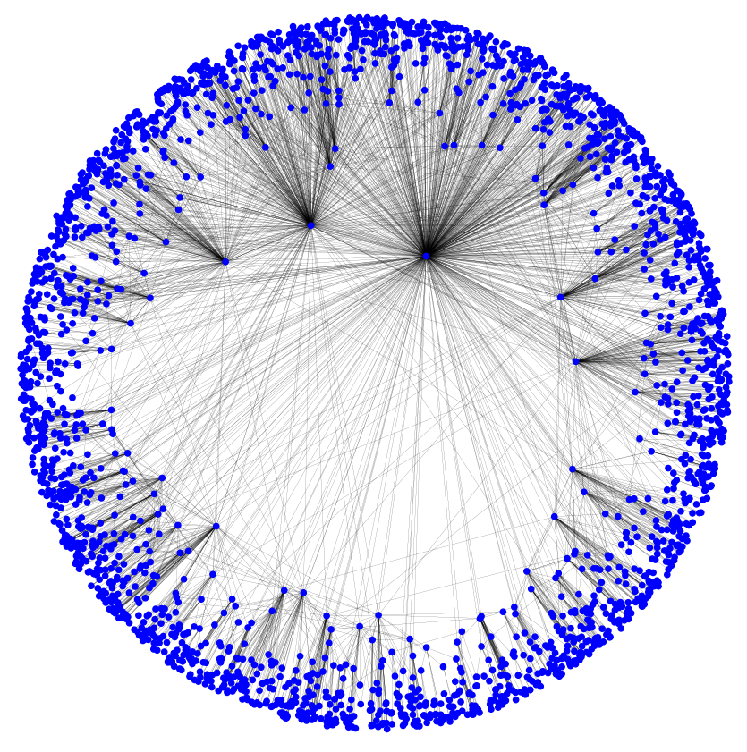

# Effects of Defectors on Greedy Routing in Complex Networks
### Nick Steelman, Matt Brucker

#### Abstract
In current Internet of Things (IoT) networks, the success of the network relies upon the successful sending of messages from one node to another. Network navigation  can be difficult if each node only knows its current surroundings, but it can be successful as long as each node passes the message to the neighbor most likely to be close to the destination. If all devices cooperate in the sending of messages, the system as a whole achieves success; but if a certain percentage of devices refuse to pass on messages, complete breakdown of the network can occur. In this paper, we reconstruct and build upon the work of Kleineberg, Kaj-Kolja and Helbing. We replicate their model, in which individual nodes pay a cost to help send messages, but are rewarded for helping successfully deliver a message; each node may defect depending on how much they profit. We construct synthetic networks with a power-law degree distribution, mapping to the real-world topology of networks like the IoT. We next simulate message-sending by performing greedy routing. Kleineberg et al. propose a method of routing which has nodes choose to copy the behavior of one of their neighbors randomly when deciding whether to pass on messages or drop them. From replicating this method, we find that the system reaches a bistable state of cooperation or noncooperation that is dependent on the initial cooperators, as well as the payoff for successfully sending messages. Finally, we propose an alternate method to defection that more closely approximates the behavior of actual IoT devices. Rather than copying based on neighbors, our method has nodes simply choose randomly whether to defect based on their payoff from sending messages. We investigate how this system responds qualitatively to variations in parameters and find whether the system also has the bistable property.

#### IoT and Greedy Routing

Mesh networks - such as the IoT - send messages by "hopping" from device to device. However, sending a message has a cost: sending packets requires power and data, and in the actual transmission of data in IoT devices, there is no explicitly-defined payoff for most of the nodes involved with the successful sending of a message. Therefore, it may not be worthwhile for devices to participate in this process. Kleineberg et al. propose a model in which each node, potentially representing an individual IoT device, decides whether it will participate, and continue to participate, in the message-sending process, based primarily on two factors: the cost associated with helping send a message, and the payoff for the successful sending of a message. This payoff is some distributed reward that is given to all nodes that help successfully deliver a message: in a real-world context, this could take the form of a small amount of cryptocurrency given to each machine in the network. Based on how much payoff it's getting relative to the amount of power and time it's paying, each node can decide to "defect" - i.e., it can still be sent messages, but it drops any message it receives. With this behavior for nodes, macro-scale patterns begin to emerge, leading to potential success or total breakdown over larger periods of time.

#### Simulating Greedy Routing

The process of getting a message to its destination in a network without complete knowledge is complex. In Kleineberg et al., they simplify the spatial aspect of the problem by mapping each node in polar coordinates, with *r* representing the relative degree of a node (lower *r* means more connected) and *theta* representing the relative clustering of the data where nodes with similar thetas are more likely to be connected to each other. This spatial property enables individual nodes to effectively guess which node is likely to be connected to its target by comparing *r*'s and *thetas*. With this knowledge, when a node sends a message, it will send it to the most likely neighbor who will send the message to its most likely neighbor and so on until a defector or loop is reached or the message is delivered.

##### Building Complex Networks

We construct synthetic complex networks using the same method as Kleineberg et al, starting with a number of nodes *N* with each node assigned a value for *k*, which is indirectly controls the degree of the node, randomly sampled from a power law distribution:

</img>

Where *alpha* is a parameter based on the mean degree of the network, and *gamma* is the degree of the power-law distribution of *k*, in the range (2,3). Each node also also has a *theta* drawn from a uniform random distribution on (0, 2pi). We connect each pair of nodes with a probability that is correlated to how close the thetas of the nodes are and how high the *k* values of the nodes are (Equation 5, [[1]](www.nature.com/articles/s41598-017-02910-x)). Finally, we assign a radius *r* based on its value of *k*, with higher *k* values giving lower *r* values (Equation 6, [[1]](www.nature.com/articles/s41598-017-02910-x)).

 </img>

**Figure 1.** A synthetic complex network constructed with *N* = 2500.

As can be seen in *Figure 1*, The values *r* and *theta* map each node into a 2-dimensional polar space. Two nodes' distance in this space represent their similarity, not their physical distance; two nodes that are close to each other are similar. Also note that low values of *r* are rare, as they correspond to high values of *k*, which has a low probability in a power law distribution.

##### Greedy Routing

*Greedy routing* is a process of sending messages from a source to a destination by hopping from node to node, where each node forwards the message to its neighbor that is closest to the destination. Each node determines whether to cooperate or defect based on how much payoff it's getting; if a node keeps spending resources without any payoff, it becomes more likely to defect. Kleineberg et al. perform greedy routing in three phases:

 </img>

**Figure 2.** A synthetic complex network constructed with *N* = 2500 and *C0* = 0.6. Orange nodes represent defectors.

1. *Initialization:* After creating a synthetic complex network of *N* nodes using the process above, we distribute the initial cooperator and defector nodes randomly with proportion *C0*.

2. *Navigation:* We randomly choose two nodes as the source and destination nodes for a message. Nodes then attempt to bring the message closer to the destination by forwarding it to their neighbor closest to the destination; "closest" is dependent on the distance in the *r-theta* space, but also on the degree of a node, so nodes are more likely to send messages to high-degree neighbors. This occurs until the message is successfully delivered, or until sending fails from either reaching a defector node or reaching a loop. At this point, payoffs are calculated: all nodes that participated in the sending start with an initial payoff of -1, since they used resources to help send the message. If the sending is successful, they all receive a share of the payoff, *b/l*, where *b* is the total payoff for a successfully sent message and *l* is the length of the chain of nodes that sent the message.

3. *Redistribution:* After *N* messages are sent, whether successfully or unsuccessfully, each node has a chance to change their defector status. Kleineberg et al. determine the probably of changing status by having each node randomly pick a neighbor and copy its state with a probability based on the difference between payoffs (Equation 2, [[1]](www.nature.com/articles/s41598-017-02910-x)); the lower a payoff, the more likely a node is to change status. In our model, we simulate this process differently, as we discuss later in the paper. After each node has a chance to change its state, the process of navigation begins again.

#### Impact of System Parameters

In examining the system, there are a large number of parameters to vary; as such, we must narrow the scope of our investigation. In the original paper, the authors decided to examine the effects of the parameters *b*, the payoff for successful delivery, and *C0*, the initial rate of defectors, as these parameters impact the process of greedy routing, which is their focus.

*Figure 3* shows how the proportion of cooperators in the network increases over time; after about 50 iterations, the proportion of cooperators settles at approximately 0.86, although convergence takes longer and settles at a slightly lower proportion when *b* = 10. This illustrates this the effect of *b*; with a higher payoff value, the time to converge to a state of high cooperation is faster, and the steady-state proportion of cooperators is lower - this impacts the probability of successfully sending a message, as we investigate later in the paper.

 </img>

**Figure 3.** The proportion of cooperators over time, with *N* = 1000, and *b* = 10 and 25, and *C0* ~= 0.7.

#### Previous Results

 </img>

**Figure 4.** Results of the defector networks simulated over a range of starting defector populations and payoff rates. Taken from Kleineberg et al.

Kleineberg et al.'s experiment illustrates properties of their network after reaching a steady state by simulating it over a variety of initial defector rates and payoff rates - as can be seen in *Figure 4,*, where they demonstrate their model over payoff rates *b* and initial conditions *C0*. There are two distinct sections - the upper blue section, where there is a high probability of a message being successfully sent, and the lower, red section, where the probability of successfully sending messages is low. This simulation was run with a graph of 10,000 nodes and averaged over 50 separate graphs at each point over 250 iterations.

#### Simulation

Since their experiment would take a prohibitive amount of time for us to replicate exactly, we scale back Kleineberg et al.'s experiment notably. Our replication runs 20 iterations of message sending on a smaller graph of 200 nodes before recording the state of the system over 5 iterations. Additionally, the proportion of successfully sent messages was lower when replicating the routing since our simulation resulted in nodes being connected differently, with many nodes having no neighbors - so we increase the degree in order to remain accurate to their simulation.

 </img>

**Figure 5.** The proportion of successful messages in the network as a function of the payoff, *b*, and the initial proportion of cooperating nodes, *C0*. Simulated with 20 steps on a network with *N* = 200, *gamma* = 2.5, and mean degree of 6.

As can be seen in *Figure 4 and 5,* the percentage of sent messages after the system reaches a stable state is highly dependent on the initial proportion of cooperators, as well as the payoff. With a high payoff for successfully sent messages, the success will propagate, and even with a low initial proportion of cooperators, the system will eventually reach a state of mostly cooperation; the same goes for having a high initial proportion of cooperators. Our results also exhibit several important behaviors demonstrated in Kleineberg et al.'s paper. First, as shown in Figure 5, our system has the bistable behavior that Kleineberg et al. found (shown in Figure 4), in which the system often reaches a functional state where almost all nodes either cooperate or defect. When run to sufficient extent, bistable systems have a critical point (or line/plane depending on number of variables) in which all states on one side are all one state and all on the other side are the other. The blue area in Figure 5 shows the success state, where almost all nodes cooperate; the red area shows the state in which almost all nodes defect.

Our graph is more noisy and less polarized than Kleineberg et al's, which is due to the fact that our graph is smaller and averages over fewer iterations. Additionally our graph has a larger proportion of successful states over failure states. This also stems from the computation and time limitations we run into which forces us to use smaller graphs. Since smaller graphs on average have shorter paths from one node to another the payoff for a delivery is split between few nodes. Therefore, the same *b* would lead to more payoff per node and be able to sustain a small graph such as ours compared to the giant graph used in the original experiment.

 </img>

**Figure 6.** The proportion of cooperating nodes over time. Simulated in a graph with *N* = 1000, *gamma* = 2.5, mean degree = 6, *b* = 25, and *C0* ~= 0.2.

We illustrate this bistable property through the proportion of cooperators over time. As *Figure 6* shows, with a high reward for successful delivery (*b* = 25) the proportion of cooperators increases rapidly, even with a low initial proportion of cooperators. Similarly, the proportion of successful message deliveries also increases, although not at the exact same rate as the proportion of cooperators, since there will always be some failures due to loops in the message sending process. This graph also displays behavior similar to Kleineberg et al's (Figure 3a, [[1]](www.nature.com/articles/s41598-017-02910-x))

#### An Alternative System of Defecting

In the algorithm used by Kleineberg et al., each node decides whether to defect by observing the state of its connected nodes and randomly copying the behavior of one neighbor. We found this behavior to be an overly complex methodology that doesn't map well to how actual IoT devices behave, since actual IoT devices don't directly observe the functions of other devices. Even for IoT devices in a messenger network, it would not be practical to constantly observe the profit of proximal nodes. Instead, most IoT devices act on their own and behave based on their own state. We propose a simplified version of the "defector decision" in which each node decides whether to defect based solely on the internal optimization of its payoff. This would map more closely to the behavior of a network of IoT devices: a device may have a built-in setting to disable itself if it's consuming too much power, or the user of the device may also choose to disable it if it uses excessive power. The more matches the mindset of would be devices controlled by a company or user, who is more concerned with absolute profit rather than comparative profit.

#### Internal Greedy Decision-Making

We perform the optimization and decision-making of each node randomly, based on the total payoff of each node, with a higher the payoff resulting in  lower probability the node will defect.

</img>

This equation exhibits the property that the more profit a node gains, the less likely it is to defect and vice versa with net loss leading to higher chance of defection. Where *w* is the net loss or gain of a node and *k* modulates the randomness in the probability of defection.

Additionally, each defected node also has a random chance, *C,* of re-cooperating in order to account for things like users turning devices back on. The longer since a node defected results in a higher probability the node will undefect.

</img>

Following this equation, as time increases, the chance that a node will undefect increases. Where *t* is the time since the node became defected and *k* modulates the randomness in the probability of defection.

#### Results of Internal Greedy decision-Making
Similar to the main graph in Kleineberg et al., we run the system with our version of defection for a range of payoff values and initial conditions, shown in *Figure 7.*.

</img>

**Figure 7.** The top graph shows the rate of defector nodes (denoted by color) versus the payoff and initial condition, with *N* = 100. Similarly, The bottom graph shows the rate of dropped messages versus the payoff and initial condition. Each point is averaged over 5 rounds on 3 different graphs after 30 iterations.

*Figure 7* shows substantially different results to those found by Kleineberg et al. First, since the nodes are now motivated by individual profit rather than profit in comparison to their neighbors, they can now all defect if they are not making back what sending the message costs. The solid block of red on the left hand side for values less than 3 is the manifestation of this feature. Since paths between nodes are at minimum 2 nodes long and often times 3 or longer and since the payoff *b* is split equally between nodes, a *b* lower than 3 will make it impossible for nodes to make up the 1 cost to send a message even if all messages are delivered successfully. Thus, all nodes for low b values will be forced into defection.

Additionally, our graphs are clearly noisier than the previous ones. This is due to the significant scale back we had to do due to hardware restrictions. Given enough time and iterations, the noise in the graph should give way to a clear curve like the example.

Finally our graph shows no correlation between the starting defector rate of the graph and the steady state defector rate. With the old method of defection, nodes re-cooperated based on the surrounding nodes. Since the new method is temporally based, even a graph of all defected nodes may convert back into all cooperators. What determines the likelihood of this conversion is not the starting proportion of defectors but the payoff for a message (as shown in figure 7) and the state of the hub nodes in the graph.

</img>

**Figure 8.** The rate of defected nodes and defected hubs over time, averaged over 10 different graphs of *N*=100, *C0*=1 and *b*=8.

*Figure 8* shows the progression of an average graph starting at full defection over time, tracking defection rate of all nodes(orange) and the top 5 hubs (blue). As expected both drop proportionally, but the hubs rest at a substantially lower rate than the average. This is due to their role as centers. Since they connect most nodes, a message that goes through a hub will be more likely to reach its destination than a fringe node sending out a message. Therefore, the hubs will receive on average a greater payoff and be less likely to defect. Furthermore, they are integral to the functioning of the graph to the point that without them undefecting from a non-functioning graph, the graph will not convert.

</img>

**Figure 9.** The rate of defected nodes and defected hubs over time with the 5 hubs set to always defect, averaged over 10 different graphs of *N*=100, *C0*=1 and *b*=8.

*Figure 9* shows the integral role of hubs on the graph. Under the exact same conditions as figure 8 but with the hubs always defected, the graph is unable to reach a workable state with a defection rate of 0.9 for all nodes. This shows that hubs must cooperate for the graph to work and that their presence allows a completely defected graph to become cooperative under our model. The dip at the beginning of the graph can be explained by the wave of the initial undefectors as they are "fixed", but are eventually re-defected as they lose "money" from lack of successful messages.

#### Conclusion

Overall, our extension shown in *Figure 7* exhibits limited similarity to those generated with the original defection method. Increasing b the payoff increases the final proportion of cooperators and the success rate for sending messages. However, in the graph, there does appear to be less of a solid divide between successful and unsuccessful states. Besides noise due to a low number of averaged iterations, this is also likely caused by a less noticeable bi-stability in the system. In the original system, each node defecting would make other nodes more likely to defect since each node chooses to copy the state of a random neighbor, so once a few nodes defect, the rest are more likely to follow. Our method of defecting removes that effect, so the critical point of success is much less prominent. Finally, our method removes the importance of the starting state of the system, since the hubs may cooperate and due to their central location they will remain active and encourage the functioning of the whole system.

Kleineberg et al. explore participatory greedy routing and find that the system has a bistable property, reaching a successful or unsuccessful state dependent on the payoff and initial proportion of cooperating nodes. We replicate their findings, concluding that the model of message routing studied by Kleineberg et al. is an abstraction that, although interesting, doesn't map very well to reality. In the proposed example of IoT devices, their method of determining defector status through looking at neighbors is not accurate for IoT networks, which are more concerned with personal payoff. Instead, defection based on individual payoff better simulates the behavior of nodes in this network. After simulating the same situations with this new method of defecting, we find that the system loses some of its bistability; when nodes are no longer looking to their neighbors, the system loses the "avalanche effect" of a few nodes choosing to cooperate or defect. This yields results more grounded in the reality of how IoT devices behave.

#### Annotated Bibliography

[1] Kleineberg, Kaj-Kolja, and Dirk Helbing. “Collective navigation of complex networks: Participatory greedy routing.” Nature News,
Nature Publishing Group, 6 June 2017, www.nature.com/articles/s41598-017-02910-x. Accessed 21 Sept. 2017.

*This paper dives into abstracting a simulating systems such as the emerging network of IoT devices which desire
to send data to a desired location. Since it is not efficient for every node to know the state of the entire system,
a method of communication can be a form of "greedy algorithm" in which each nodes sends the data to the nearest neighbor
closest to the destination. However, they added in a probability that a node would become a "defector" which renders the
message unsendable and in large numbers invalidates the network. This probability is based on the number of defector neighbors
and how much a reward the node gets for properly delivering a message. They found that each graph they instantiate either
collapses into nearly all defector or participant given enough time. The probability of collapsing into each is heavily
influenced by both the size of the kickback the nodes receive and the state of some "hubs" in the graph that connect to
a large number of nodes. Additionally, they found the state of defectors tend to first organize themselves into clusters
of all participant or all defector.*

[2] Krapivsky, P. L., and S. Redner. “Emergent Network Modularity.” [1706.01514] Emergent Network Modularity,
20 June 2017, arxiv.org/abs/1706.01514. Accessed 18 Sept. 2017.

*This paper explored a model of graph growth and it's emergent properties. The method of growth was
for every new node added, it was randomly assigned to a node in the graph, and then randomly connected
to a neighbor of that node. The paper cited several applications of this application in the past with
directed graphs and proposed to further explore the concept in the context of undirected graphs, which
better approximate topics such as social media connections, which are often two way. However, they did
not much go into the connection of this growth to real world systems, but rather explored some
conterintuitive properties of the network, mostly the surprising amount of "star structures" that arise.
Star structures are when a single node is the only connection between all other nodes in the graph. They
appear at a startling amount for this growth, with a 2/(N-1) occurrence for N nodes. The same rate applies
for star graphs with little imperfections. Additionally, the likelihood for very large star structures to
develop with very large graphs (~E6 Nodes) is also very likely, with the graphs appearing as shallowly linked
individual structures rather than a cohesive unit.*

[3] Pastor-Satorras, Romualdo, and Allesandro Vespignani. "Epidemic Spreading in Scale-Free Networks." https://journals.aps.org/prl/pdf/10.1103/PhysRevLett.86.3200

*This paper investigates the spreading of epidemics in scale-free networks. Using a susceptible-infected-susceptible model in which nodes are susceptible, become infected, and recover to become susceptible again, fixed-size networks have an epidemic threshold, a rate of spreading below which the disease dies out. Vespignani and Pastor-Satorras apply this model to scale-free networks, with two important discoveries. Firstly, in scale-free networks, the epidemic eventually reaches a steady state where the proportion of infected nodes remains the same. The second discovery is that this proportion is always > 0 for any disease that has a nonzero rate of infection. They compute these findings by investigating epidemics in the Internet, using data from the spreading of computer viruses as validation.*
