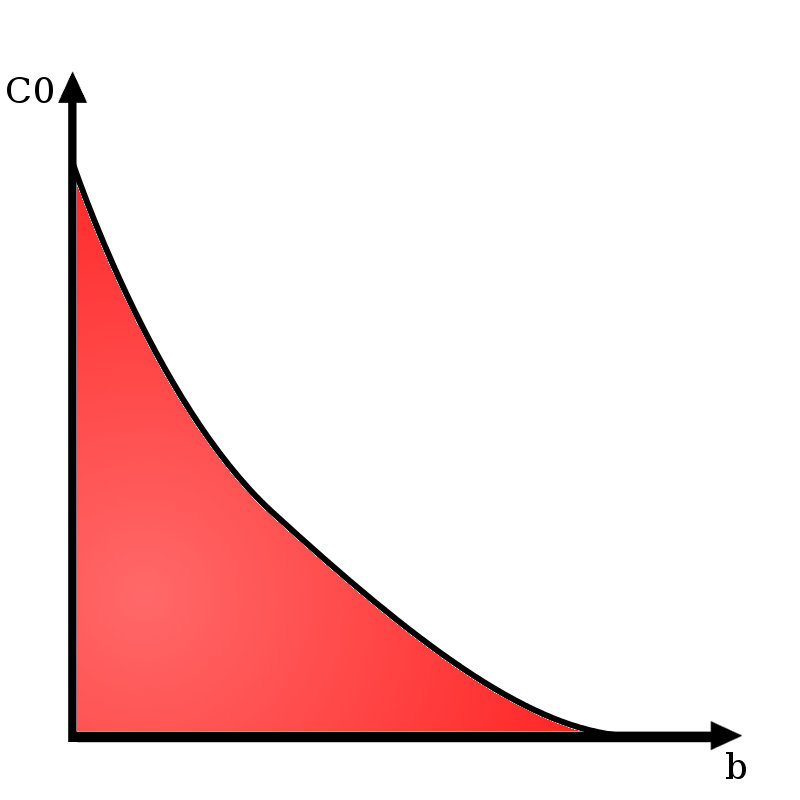
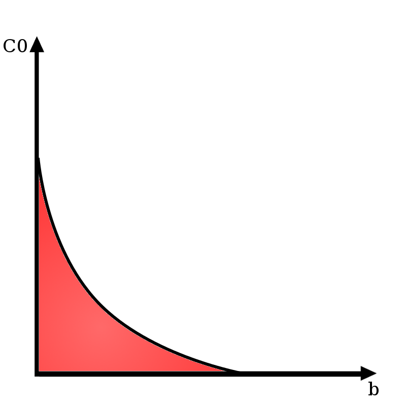

# Exploring Effects of Topologies in Participatory Greedy Routing
### Nick Steelman and Matt Brucker

#### Abstract:
The paper “Collective navigation of complex networks: Participatory greedy routing” explores the world of IoT devices
and their abstraction into graphical models. The paper modeled the affect of "defector" nodes in the network's ability to send information from one side of the network to the other. Defector nodes are instantiated in the model and can spread their defector property to their neighbors as well as lose that property. The probability of a node becoming a defector is determined by the presence of defectors in its proximity, the amount of messages sent, and the amount of reward the node gets from sending a message. The paper found compelling results on the importance of the reward each node recieves when it sucessfully delivers a message and the imporance of the state of "hubs" in the network, but their model was tested under very specific circumstances. We plan to investigate into the role of different graph types, algorithms to determine defection,  algorithms to determine kickback, and initial states of the board on the spread of defection.

#### Bibiliography

##### Citation:
Kleineberg, Kaj-Kolja, and Dirk Helbing. “Collective navigation of complex networks: Participatory greedy routing.” Nature News,
Nature Publishing Group, 6 June 2017, www.nature.com/articles/s41598-017-02910-x. Accessed 21 Sept. 2017.

##### Summary:
This paper dives into abstracting a simulating systems such as the emerging network of IoT devices which desire
to send data to a desired location. Since it is not efficient for every node to know the state of the entire system,
a method of communication can be a form of "greedy algorithm" in which each nodes sends the data to the nearest neighbor
closest to the destination. However, they added in a probability that a node would become a "defector" which renders the
message unsendable and in large numbers invalidates the network. This probability is based on the number of defector neighbors
and how much a reward the node gets for properly delivering a message. They found that each graph they instantiate either
collapses into nearly all defector or participant given enough time. The probability of collapsing into each is heavily
influenced by both the size of the kickback the nodes recieve and the state of some "hubs" in the graph that connect to
a large number of nodes. Additionally, they found the state of defectors tend to first organize themselves into clusters
of all participant or all defector.

##### Citation:
Krapivsky, P. L., and S. Redner. “Emergent Network Modularity.” [1706.01514] Emergent Network Modularity,
20 June 2017, arxiv.org/abs/1706.01514. Accessed 18 Sept. 2017.

##### Summary:
This paper explored a model of graph growth and it's emergent properties. The method of growth was
for every new node added, it was randomly assigned to a node in the graph, and then randomly connected
to a neighbor of that node. The paper cited several applications of this application in the past with
directed graphs and proposed to further explore the concept in the context of undirected graphs, which
better approximate topics such as social media connections, which are often two way. However, they did
not much go into the connection of this growth to real world systems, but rather explored some
conterintuitive properties of the network, mostly the surprising amount of "star structures" that arise.
Star structures are when a single node is the only connection between all other nodes in the graph. They
appear at a startling amount for this growth, with a 2/(N-1) occurence for N nodes. The same rate applies
for star graphs with little imperfections. Additionally, the likelyhood for very large star structures to
develop with very large graphs (~E6 Nodes) is also very likely, with the graphs appearing as shallowly linked
individual structures rather than a cohesive unit.

##### Citation:
[Epidemic Spreading in Scale-Free Networks](https://journals.aps.org/prl/pdf/10.1103/PhysRevLett.86.3200)
*Pastor-Satorras, Romualdo; Vespignani, Allesandro;*  

##### Summary
This paper investigates the spreading of epidemics in scale-free networks. Using a *susceptible-infected-susceptible* model in which nodes are susceptible, become infected, and recover to become susceptible again, fixed-size networks have an epidemic threshold, a rate of spreading below which the disease dies out. Vespignani and Pastor-Satorras apply this model to scale-free networks, with two important discoveries. Firstly, in scale-free networks, the epidemic eventually reaches a steady state where the proportion of infected nodes remains the same. The second discovery is that this proportion is always > 0 for any disease that has a nonzero rate of infection. They compute these findings by investigating epidemics in the Internet, using data from the spreading of computer viruses as validation.

#### Experiment Design:

The main experiment we plan to replicate is the participatory greedy routing experiment in Kleineberg and Helbing. We will replicate their construction of the synthetic complex network, then simulate the greedy routing process for a long enough time for the system to reach a steady-state, and observe the outcome of the network (functioning vs. non-functioning) as a function of the payoff reward and initial proportion of defectors, as explored in the paper. For the sake of reasonable project scoping, we don't plan to investigate any of the further questions the paper explores. For an extension, we plan to introduce elements of Pastor-Satorras and Vespignani by simulating greedy routing on a scale-free network, and comparing the results to the original synthetic network; in particular, we will investigate how the hub nodes affect the outcome of the network by running the experiment and assigning nodes' probabilities of being a defector based on their degree - i.e, the hub nodes are more likely to be defectors initially than other nodes.

**The output of our experiments could look something like this:**

A potential result of our simulation for the original synthetic network. The red area shows the failure state of the network as a function of the original proportion of defectors *C0* and the payoff *b*.

A potential result of our simulation on a scale-free network.

The main thing we'll be interpreting in our results is the area of the failure-state of the network in the *b-C0* graph. If the area of the failure state in the scale-free network is smaller than in the synthetic network, it will indicate that the scale-free network is less likely to fail than the synthetic network, or vice versa.

Some problems we may run into include making decisions about how to map the graph into a 2 dimensional space. The paper the
experiment is based on uses some somewhat complex functions to determine distance, so we will need to either determine how to use those and which parts are important or make our own graph with a its compelling explanation for architecture. Additionally, it may be difficult to determine the best qualities of the graph to vary in order to yield interesting results.

#### Next Steps
1. Agree on best way to construct the positions and connections inside the graph.
2. Write code to make the graph
3. Write function to simulate message transmission across nodes.
4. Write functions to update individual nodes with defection probabilities.
5. Run the functions a bunch of times.

##### Immediate Next Steps:
**Matt:** Read the Appendix A of the participatory greedy routing paper to figure out how to build the synthetic complex network, and start writing functions in Python to create the network.
